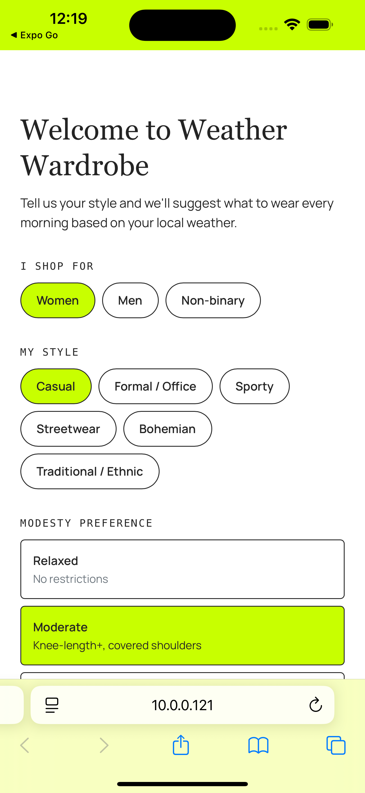
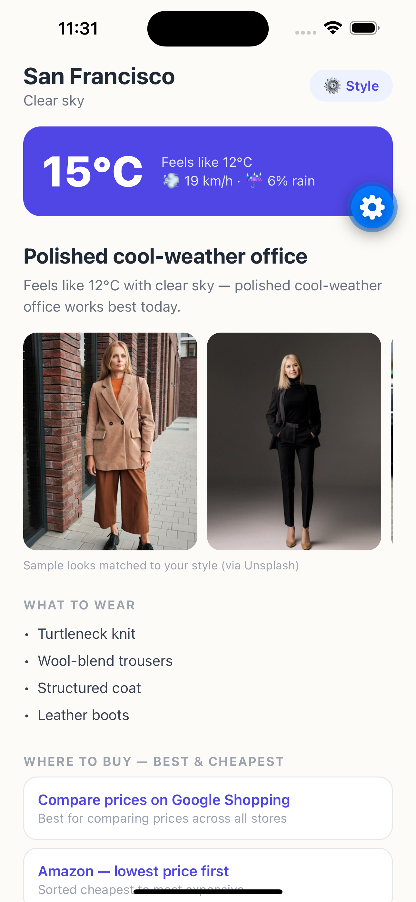

# Weather Wardrobe 👗🌦

An Expo (React Native) app that sends a **daily notification** suggesting what
to wear based on your **current location and weather**, personalized by
**gender, style choice, and modesty preference** — with sample outfit images
and links to find each look at the best and cheapest price.

## Screenshots

| Onboarding | Home |
| :---: | :---: |
|  |  |

## Features

- **Onboarding profile** — pick who you shop for (women / men / non-binary),
  your style (casual, formal, sporty, streetwear, bohemian, traditional), and
  modesty level (relaxed / moderate / high — high coverage swaps shorts and
  sleeveless pieces for full-length items and adds an optional headscarf).
- **Live local weather** — uses your device location with the free
  [Open-Meteo](https://open-meteo.com) API (no API key required), including
  feels-like temperature, rain probability, wind, and snow.
- **Outfit engine** — 6 temperature bands × 6 styles × 2 gender matrices with
  modesty and weather adjustments (umbrella, waterproof boots, sunscreen…).
- **Sample images** — three keyword-matched look photos per recommendation.
- **Where to buy** — one-tap links to Google Shopping (price comparison),
  Amazon sorted lowest-price-first, and H&M budget picks.
- **Daily notification** — scheduled at your chosen morning time, with the
  outfit and temperature in the message. A background task periodically
  re-fetches weather and refreshes the notification content.

**Live web version:** https://sivarajh.github.io/weather_wardrobe/ —
installable as a PWA, auto-deployed from `main` by GitHub Actions.

## Run it

```bash
npm install
npx expo start
```

Scan the QR code with **Expo Go** (Android) or the Camera app (iOS).

### Test in the browser (web)

```bash
npx expo start --web
```

This opens the app at http://localhost:8081 (or press `w` in an already
running `npx expo start`). The browser will ask for location permission —
allow it to see live weather and the outfit recommendation.

### PWA install & web notifications

The web version is an installable PWA (manifest + service worker, generated
icons). In Chrome/Edge use the install icon in the address bar; on iOS Safari
use Share → "Add to Home Screen".

Daily notifications on web use the browser **Notification API**: completing
onboarding asks for notification permission, then an in-page scheduler fires
the outfit notification at your chosen time and re-arms for the next day.
Notifications display through the service worker, so clicking one focuses or
reopens the app.

Web limitations:

- **Notifications fire while the app/PWA is open** (including background
  tabs), but not when it's fully closed — client-only web apps can't do that;
  it requires a Web Push server (VAPID + push service). Use the native app
  for fully offline scheduled notifications.
- **No sample images** — the Unsplash search endpoint blocks cross-origin
  browser requests (CORS), so the image strip hides itself on web. Everything
  else (weather, recommendation, shopping links) works.
- **PWA install requires HTTPS** in production (localhost is exempt during
  development). Host the `npx expo export --platform web` output (which
  includes `manifest.json`, `sw.js`, and icons) on any HTTPS static host.

> **Note on background refresh:** `expo-background-task` and full notification
> behavior require a development build for complete fidelity:
>
> ```bash
> npx expo run:ios     # or: npx expo run:android
> ```
>
> In Expo Go the notification is still scheduled each time you open the app
> (with fresh weather), but OS-level background refresh may not run.

## Project structure

```
App.tsx                     # boot, onboarding vs home routing, notification setup
src/types.ts                # shared types
src/storage.ts              # AsyncStorage preferences
src/weather.ts              # location + Open-Meteo fetch + WMO code mapping
src/outfits.ts              # recommendation engine, images, shopping links
src/notifications.ts        # daily notification + background refresh task
src/screens/OnboardingScreen.tsx
src/screens/HomeScreen.tsx
```

## Deploying

### Web (GitHub Pages) — already set up

Every push to `main` runs
[.github/workflows/deploy-web.yml](.github/workflows/deploy-web.yml), which
exports the web build and publishes it to
https://sivarajh.github.io/weather_wardrobe/.

### Mobile (iOS / Android)

Use [EAS](https://docs.expo.dev/eas/) (Expo Application Services):

```bash
npm install -g eas-cli
eas login            # free Expo account
eas build:configure
```

1. **Share with friends / testers (no store):**
   `eas build --profile preview --platform android` produces an installable
   APK you can send to anyone. For iOS, internal distribution requires an
   Apple Developer account ($99/yr) and registered device UDIDs.
2. **TestFlight / Play internal testing:**
   `eas build --platform all` then `eas submit` uploads to TestFlight (iOS)
   and the Play Console (Android, $25 one-time developer fee).
3. **App Store / Play Store release:** same as above, then promote the build
   through the store consoles. Remember store listing assets (screenshots in
   `screenshots/` are a start) and a privacy policy URL — the app collects
   location, so both stores require one.
4. **Over-the-air JS updates** after release: `eas update` ships JS-only
   changes to installed apps without a store review.

EAS free tier includes a build queue; builds run in Expo's cloud, so no
local Xcode/Android Studio setup is needed.

## Known limitations

- Sample images come from Unsplash search (matched to the outfit pieces and
  style, re-ranked by subject), not the exact product — good for inspiration,
  not a catalog. The search endpoint is unofficial; if it ever stops working,
  the image strip hides itself and the rest of the app is unaffected.
- "Cheapest price" is delivered via lowest-price-sorted retailer searches;
  a true price-comparison API (e.g. Google Shopping Content API) would need
  API keys and a backend.
- iOS background tasks run at the OS's discretion, so notification content is
  refreshed opportunistically (and always on app open).
